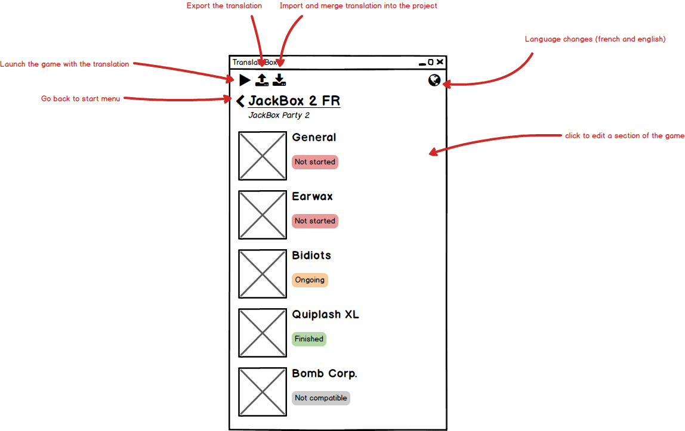
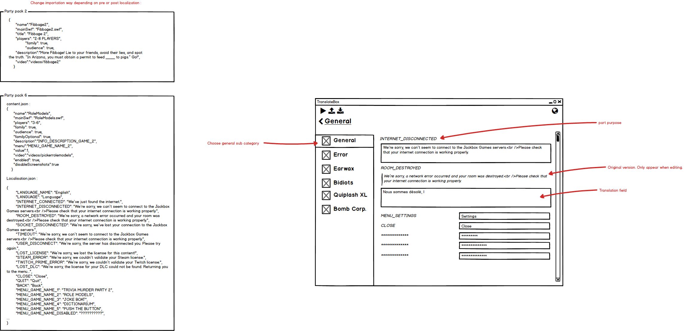
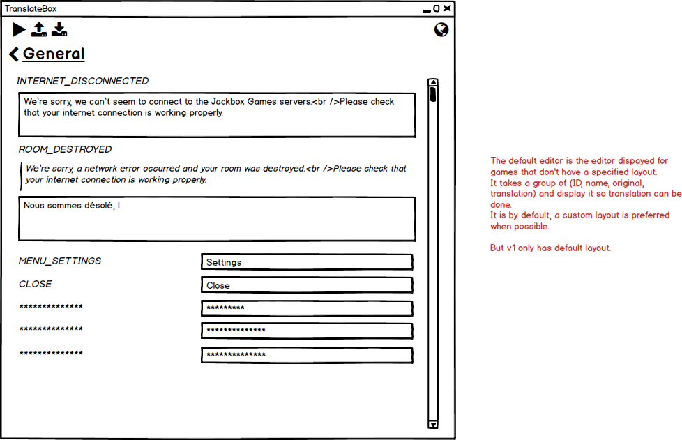

[⬅ back](../../../README.md)

# Version 1 : Mockups
*TranslatorBox/Dev documentation/Version 1/Mockups*

Those are the first mockups for the software.

## Starting window

### No projects created starting window

* Features :
  * Create a new project
  * Change the language

### Project created starting window

* Features :
  * Create a new project
  * Change the language
  * Open a project
  * Delete a project

## Project window

* Features :
  * Change the language
  * play the game
  * ~~import the project~~
  * ~~export the project~~
  * build the project
  * go back to the main window
  * open a part to translate
  * See the progress of the translation

## Part window

### For the general menu

### For the default menu
