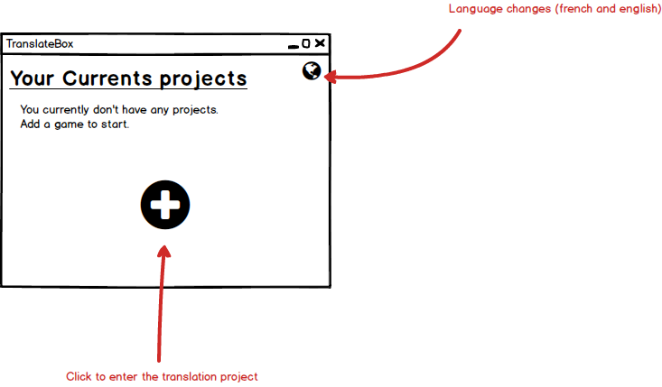
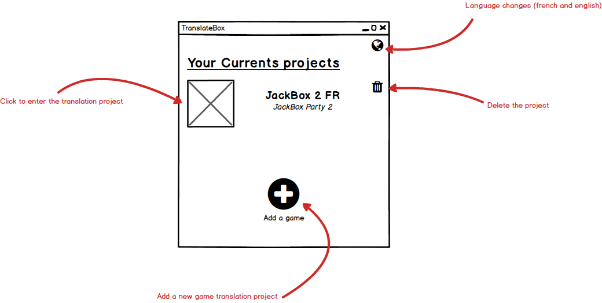

[⬅ back](../../../README.md)

# Version 1 : Mockups
*TranslatorBox/Dev documentation/Version 1/Mockups*

Those are the first mockups for the software.

## Starting window

### No projects created starting window

* Features :
  * Create a new project
  * Change the language

### Project created starting window

* Features :
  * Create a new project
  * Change the language
  * Open a project
  * Delete a project